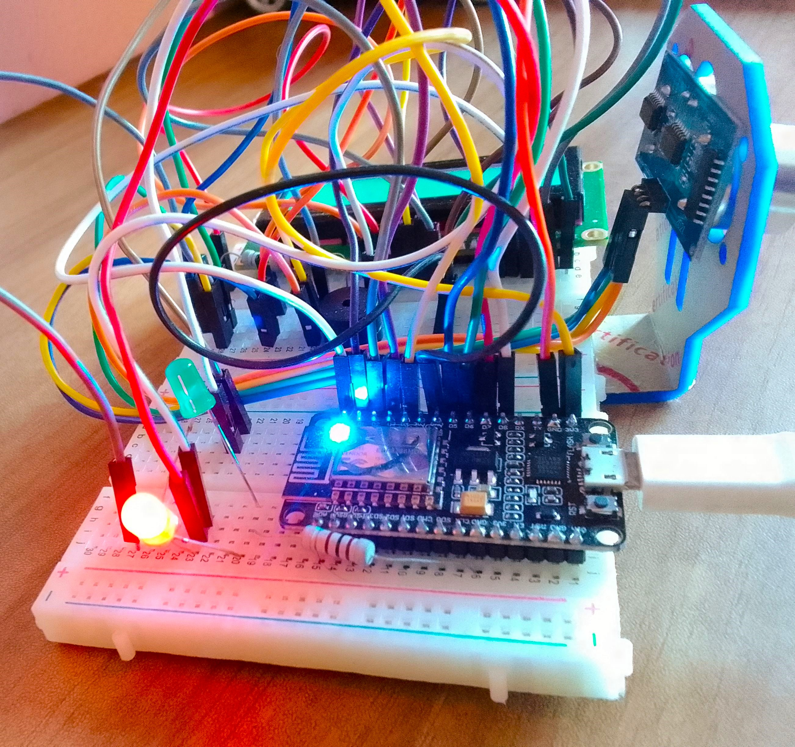

# IoT Overspeeding Detector 🚗💨

An IoT-based overspeeding detector uses an ultrasonic sensor to monitor vehicle speed within a certain range. If overspeeding is detected, a notification is sent to a Telegram bot, and data can also be monitored via ThingSpeak.

## Features
- **Real-time Speed Detection:** Detects overspeeding using an ultrasonic sensor.
- **Alerts and Notifications:** Sends instant alerts to a Telegram bot when overspeeding occurs.
- **Data Monitoring:** Logs speed data on ThingSpeak for analysis.
- **Visual Indicators:** Uses LEDs and a buzzer for local alerts.

## Components
- **NodeMCU (ESP8266):** Main microcontroller for IoT connectivity.
- **Ultrasonic Sensors:** Measure speed and distance.
- **16x2 LCD Display:** Displays real-time speed and status.
- **100Ω Resistors:** Current limiting for LEDs.
- **Red & Green LEDs:** Indicate normal and overspeed conditions.
- **Buzzer:** Audible alert for overspeeding.
- **Jumper Wires:** Connections between components.

## Circuit Diagram

## How to Use
1. Assemble the circuit as shown in the diagram.
2. Upload the code to the NodeMCU using the Arduino IDE.
3. Configure the ThingSpeak and Telegram bot credentials in the code.
4. Power the circuit and observe the speed readings on the LCD.
5. Notifications for overspeeding will be sent to the Telegram bot and logged on ThingSpeak.

## Tools and Libraries
- Arduino IDE
- ThingSpeak API
- Telegram Bot API
- LiquidCrystal library for LCD

## Demonstration

  
  
  

## Output In Console

## ThingSpeak Cloud Output and Graph

## Telegram Bot

  
  

## Summary
This IoT Overspeeding Detector combines real-time speed monitoring with efficient notification and data logging mechanisms. By leveraging ultrasonic sensors, LEDs, and IoT platforms like Telegram and ThingSpeak, it provides a practical solution for enhancing road safety and monitoring vehicle behavior effectively.

